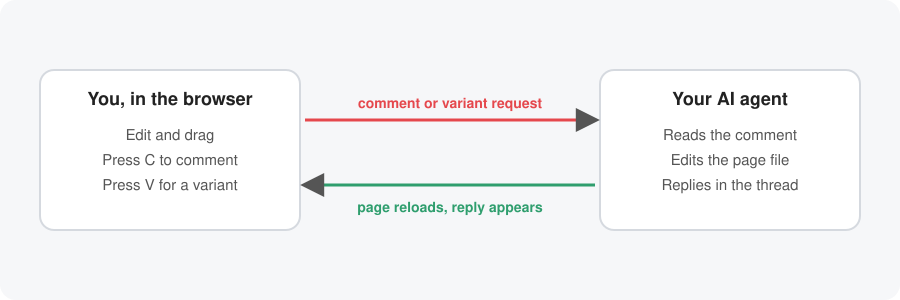
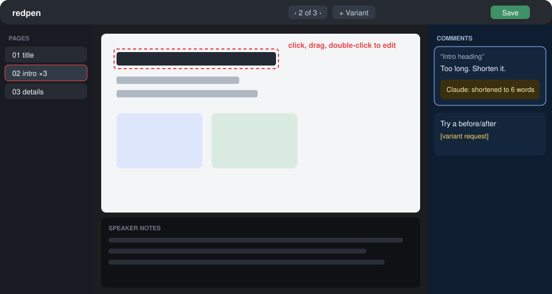
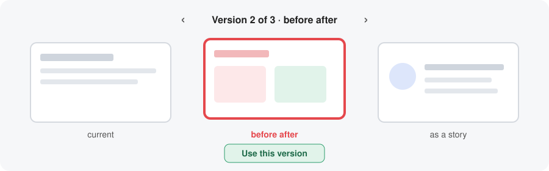
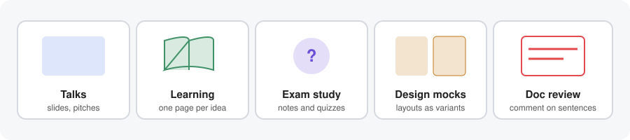

# redpen

Edit pages in your browser, comment on anything, and ask an AI agent for changes or alternate versions. The page reloads as the agent works.

It started as a slide-deck tool. It works for anything you can lay out as pages: slides, a study guide, a diagram series, a one-pager, a design mock.



## What you get



- **Visual editor.** Click to select, drag to move, double-click to edit text. Reorder pages in the sidebar. Save with ⌘S.
- **Comments in place.** Select text or an element, press **C**, type, press ⌘↵. Threads show in a side panel and close themselves when the agent answers. A mic button dictates comments (optional).
- **Variants.** Press **V** and say what to try. The agent adds a version of that page. Flip through versions with **← →**, comment on whichever is showing, and press **Use this version** to swap it in. The old page is kept as a variant, so nothing is lost.
- **Speaker notes.** A notes box under each page, saved inside the page file.
- **Live reload.** When the agent edits a file, you see it right away.
- **Present.** Click **▶ Present** (next to the logo) and pick **Full screen** or **Fill this tab**, which covers the editor but stays in the browser tab. Press **P** to repeat your last choice. Arrows, space or a click move between slides, and Esc exits.
- **Export.** PNG, all pages as a zip, PDF and PPTX.
- **Plain files.** Every page is one HTML file in a folder, so git shows exactly what changed.



## Quick start

```sh
git clone <this repo> && cd redpen
npm install                                                # only for export and render checks
node editor/editor-server.js examples/how-http-works       # open http://127.0.0.1:8137/
```

Try the example: select a heading, press **C**, write a comment. Page 02 already has a variant, so the version switcher shows up there. Press **V** to ask for another.

Start your own project:

```sh
node tools/new-deck.js projects/my-project "My project"
node editor/editor-server.js projects/my-project
python3 tools/watch-comments.py projects/my-project        # the agent's listener
```

## Canvas mode

For a system diagram, a mind map or a whiteboard, use one big Excalidraw board instead of pages.

```sh
node tools/new-canvas.js projects/my-board "My board"        # makes canvas/main.excalidraw
node editor/editor-server.js projects/my-board               # open http://127.0.0.1:8137/canvas
```

- A project can hold `canvas/*.excalidraw` files, with or without `slides/`. With no slides, `/` opens the canvas. Each file is a tab.
- It is real Excalidraw (loaded from unpkg.com, so it needs a network connection). Edits save to the file after a short pause, and timestamped copies of earlier versions are kept in `canvas/.bak/` (newest 40). If an agent rewrites the file while you have unsaved edits, the page asks whether to keep yours or load the disk version.
- The files are standard `.excalidraw` JSON, so they also open at excalidraw.com.
- An agent builds scenes with `tools/canvas-dsl.js`: `zone`, `box`, `note`, `text` and `arrow`. Labels are bound to their boxes and arrows to their boxes, so dragging a box moves both. `save()` reports overlapping boxes. If the agent rewrites the file while you are not editing, the page reloads it.
- Comments and variants are for pages and do not work on a canvas yet.

### Diagram slides

A slide can hold a live diagram. The diagram fills the slide. In the editor and when presenting, scroll or pinch to zoom at the cursor, drag to pan, and double-click a box or region to zoom to it (double-click empty space, press 0 or click **Fit** to zoom back out). The arrow keys still change slides.

```sh
node tools/new-canvas-slide.js projects/my-project 04-architecture "How it fits together" architecture
node editor/editor-server.js projects/my-project
```

This adds `slides/04-architecture.html`, which shows `canvas/architecture.excalidraw` through `/canvas?file=architecture&embed=1`. Edit the diagram at `/canvas?file=architecture`; the slide shows the same file. The example project has one on page 05.

## Using it with an agent

Open the repo in Claude Code, or another coding agent, and tell it:

> Read AGENTS.md. Start the editor and the comment watcher for `projects/my-project`, and answer every comment I leave.

For each comment the agent makes the change and replies with `python3 review/respond.py projects/my-project <comment-id> changed "<what changed>" --change --slides 03`. The reply shows in the thread. Add `--review` to keep a thread open for you to check. To install it as a Claude Code skill, copy `skill/` to `~/.claude/skills/redpen/`.

## What to use it for



1. **A talk or pitch.** "Make a 10-slide deck about our Q3 plan." Comment on slides that run long, press V on the opening slide ("try a before/after of the problem"), keep one, export a PDF.
2. **Learning a topic.** "Teach me how database indexes work, one page per idea, with a quiz at the end." Comment where you got lost ("what is a B-tree?") and the agent adds or rewrites a page. Press V on a confusing page: "explain this with a library card catalog." See `examples/how-http-works`.
3. **Exam study.** Give the agent your notes. Ask for one page per concept with a diagram and a "check yourself" page per chapter. Comment "make me a harder question" on any quiz page.
4. **A design mock.** Ask for three layouts of a landing page as variants of one page. Flip with the arrow keys and comment on each ("the button is lost on this one"). Use the one you like.
5. **A document with review.** A proposal or README. Teammates comment on sentences while the agent works through the thread.

## How it works

- A project is `projects/<name>/slides/NN-slug.html`, one 1280×720 page per file.
- Variants live in `projects/<name>/options/<page-name>--<tag>.html`. A variant belongs to the page with the matching name (`slides/02-intro.html` has `intro`).
- Comments are appended to `projects/<name>/review/comments.jsonl`. Replies and status are in `review/state.json`.
- Speaker notes sit in the page file inside `<script type="text/x-notes">`.
- The editor server has no dependencies. Export and the render checker need `puppeteer`, `pdf-lib` and `pptxgenjs`.

| Path | What it is |
|---|---|
| `AGENTS.md` | The loop and rules the agent follows. |
| `NEW-DECK.md` | Kickoff questions before building anything. |
| `template/slide.html` | The page frame, header, footer and color tokens. |
| `tools/slop-lint.py` | Flags vague phrases in page text. `respond.py` runs it and refuses to send a "changed" reply while a changed page has a flagged line. Add phrases to `tools/slop-phrases.txt`, or allow a deliberate quote in `<project>/review/slop-allow.txt`. |
| `tools/` | `new-deck.js` scaffolds a project, `render.js` renders PNGs and flags clipped text, `watch-comments.py` prints new comments. |
| `editor/` | The editor server and app. |
| `review/` | The comment API and `respond.py`, the agent's reply script. |
| `examples/how-http-works/` | A four-page study guide with one variant. |

## Keys

| Key | Does |
|---|---|
| C | Comment on the selected text or element |
| V | Ask for a variant of this page |
| ⌘⌥M (Ctrl+Alt+M) | Comment while editing text, when plain C would type a letter |
| ← → | Flip between versions of a page (between pages if it has no variants) |
| Alt + ← → | Previous or next page |
| ⌘↵ | Send the comment |
| ⌘S | Save |

## Plain-words check

`review/respond.py` runs `tools/slop-lint.py` on the pages named in `--slides` before it sends a "changed" reply, and stops if a line matches a phrase in `tools/slop-phrases.txt` (add the phrases you keep catching). Pass `--skip-slop` for a deliberate quote, or add the exact line to `<project>/review/slop-allow.txt`.

For Claude Code users, `tools/claude-slop-gate.py` is an optional hook. It blocks `git commit` and `respond.py` when page files changed and the `slop-to-english` skill has not been run since. Copy it to `~/.claude/hooks/` and add a `PreToolUse` hook for `Bash` that runs `python3 ~/.claude/hooks/claude-slop-gate.py` in `~/.claude/settings.json`.

## Dictation (optional)

Put `OPENAI_API_KEY=...` in `.env.local` at the repo root. The key stays on the server and is never sent to the page. Without it, the mic button reports an error and everything else works.

## Safety

The editor listens on `127.0.0.1` only and rejects cross-site POSTs. Do not expose it to a network without adding authentication.

**Phone or tablet.** The editor works on touch screens: Slides and Comments open as drawers, press and hold on a slide to comment, swipe left or right to change slides, and the comment box stays on screen when you pinch-zoom. To open it from your phone over a private network such as Tailscale, proxy the port (for example `tailscale serve --https=8137 http://127.0.0.1:8137`) and start the server with `EDITOR_ALLOWED_HOSTS=your-machine.your-tailnet.ts.net` so comments from that host are accepted. Only do this on a network you trust.

## License

MIT
